<h2>Vanilla Javascript Projects repository</h2>
note: some of these projects are still under development.

  preview: 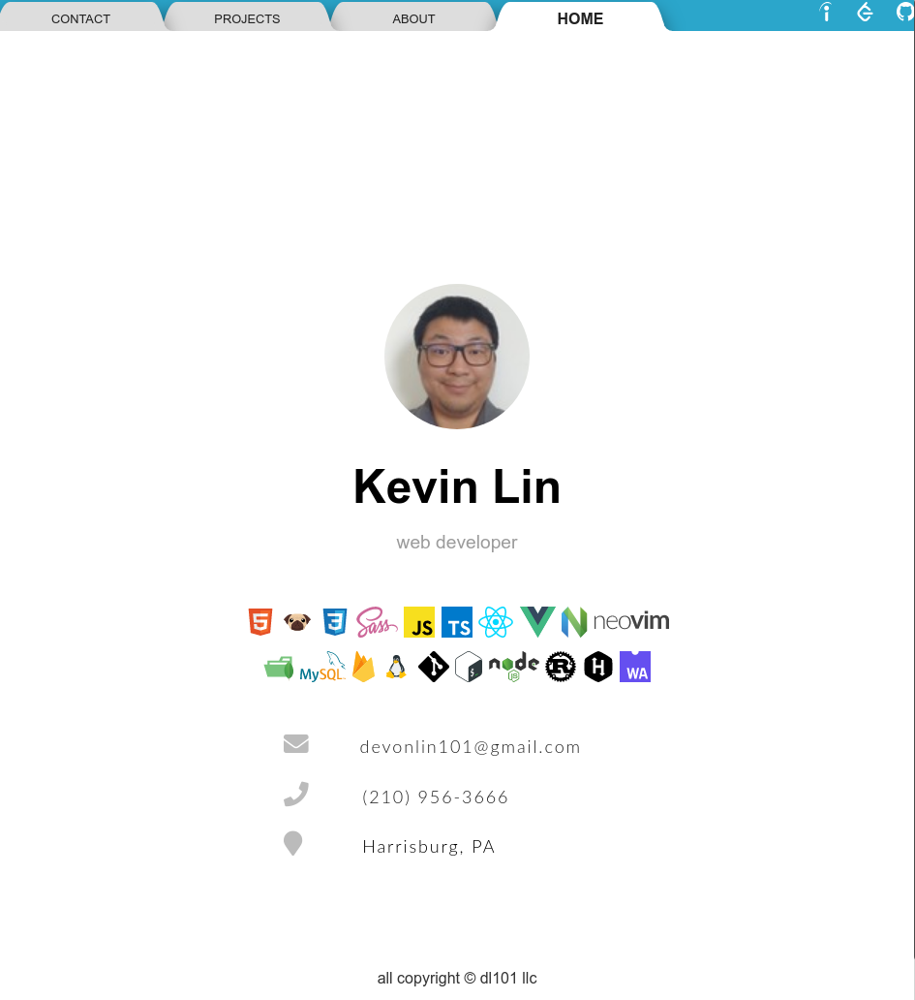
<h5>tech stacks:</h5> html, css, javascript, fontawesome, iconify, google fonts
demo: <a href='https://devonlin101.github.io/javascript-projects/portfolio-js/'>portfolio</a>
  preview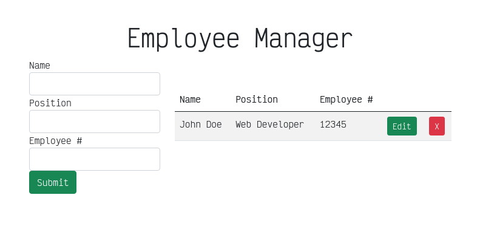
<h5>tech stacks:</h5> html, javascript, bootstrap 5
demo: <a href='https://devonlin101.github.io/javascript-projects/crud-js/'>simple javascript crud</a>
 preview: 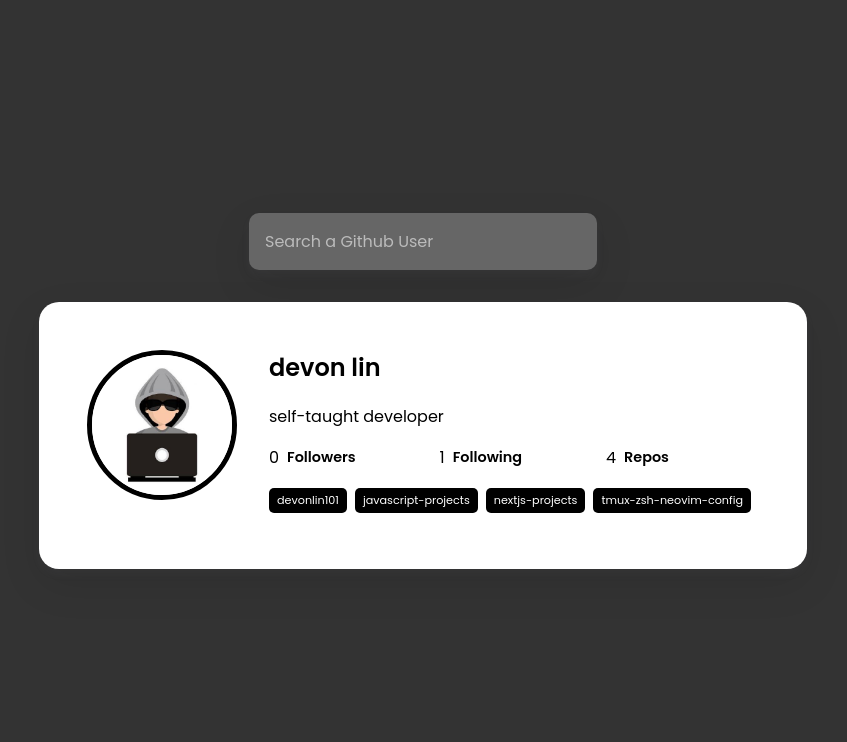
<h5>tech stacks:</h5> html, css, javascript 
demo: <a href='https://devonlin101.github.io/javascript-projects/api-js/'>github api search</a>
  preview: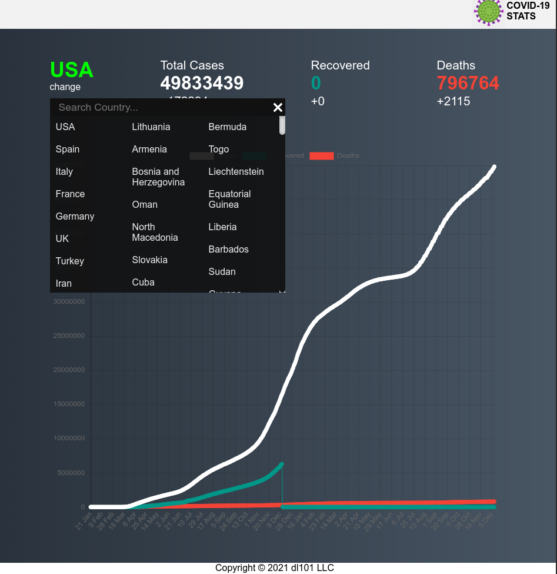
<h5>tech stacks:</h5> html, css, javascript, chart.js
demo: <a href='https://devonlin101.github.io/javascript-projects/covid19-tracker-js/'>covid 19 tracker</a>
  preview: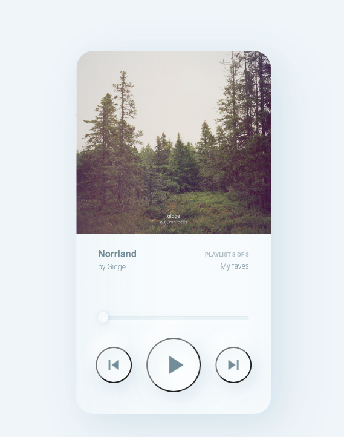
<h5>tech stacks:</h5> html, scss, javascript
demo: <a href='https://devonlin101.github.io/javascript-projects/music-player-js/'>custom music player</a>
  preview: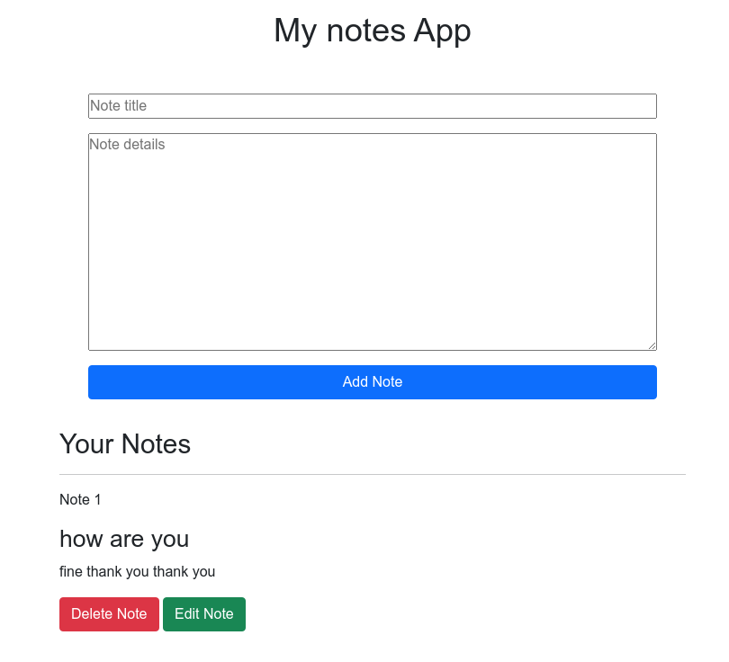
<h5>tech stacks:</h5> html, css, javascript, bootstrap 5
demo: <a href='https://devonlin101.github.io/javascript-projects/notes-js/'>notes app</a>
  preview: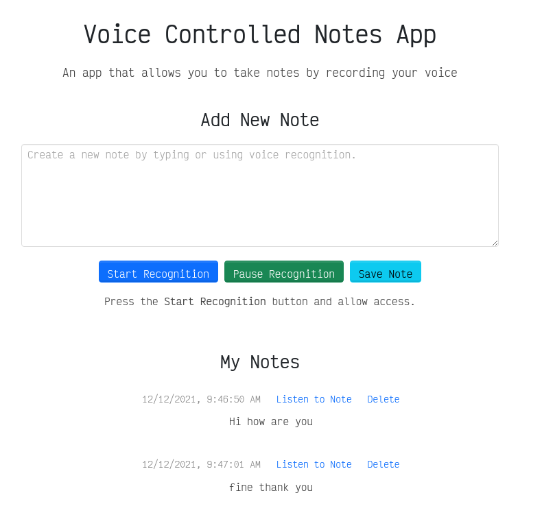
<h5>tech stacks:</h5> html, css, javascript, bootstrap 5, jquery
demo: <a href='https://devonlin101.github.io/javascript-projects/speak-text-js/'>speech to text app</a>
  preview: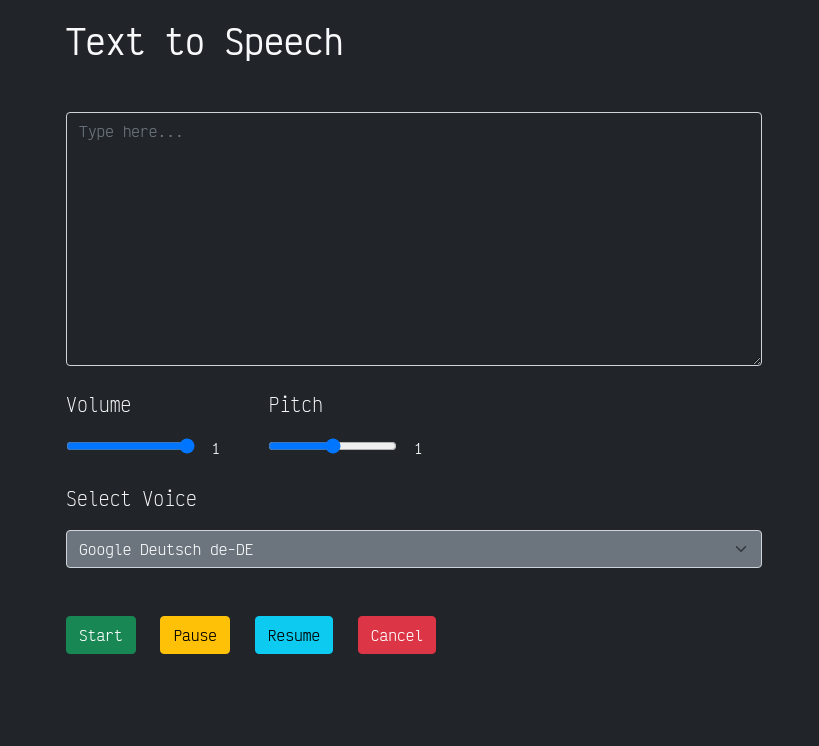
<h5>tech stacks:</h5> html, javascript, bootstrap 5
demo: <a href='https://devonlin101.github.io/javascript-projects/text-to-speech-js/'>text to speech app</a>
  preview: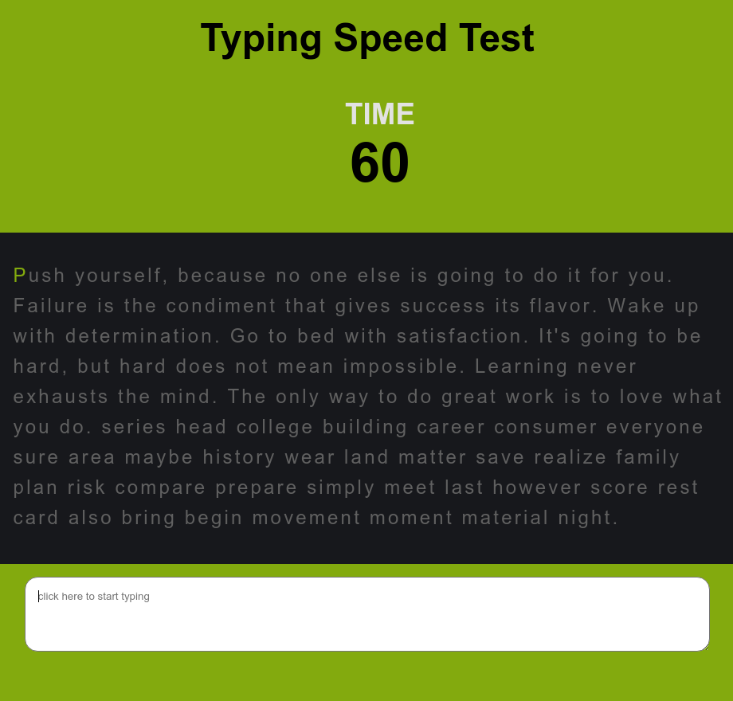
<h5>tech stacks:</h5> html, css, javascript
demo: <a href='https://devonlin101.github.io/javascript-projects/typing-test-js/'>typing speed test app</a>
  preview: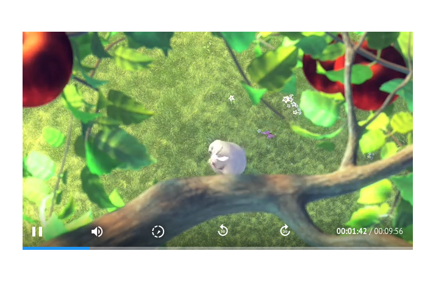
<h5>tech stacks:</h5> pugjs, scss, javascript 
demo: <a href='https://devonlin101.github.io/javascript-projects/video-player-js/'>custom video player app</a>
  preview: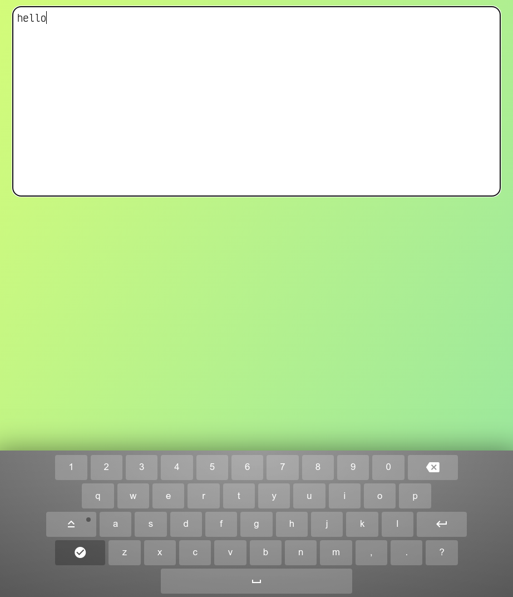
<h5>tech stacks:</h5> html, css, javascript, material icons
demo: <a href='https://devonlin101.github.io/javascript-projects/virtual-keyboard-js/'>virtual keyboard</a>
